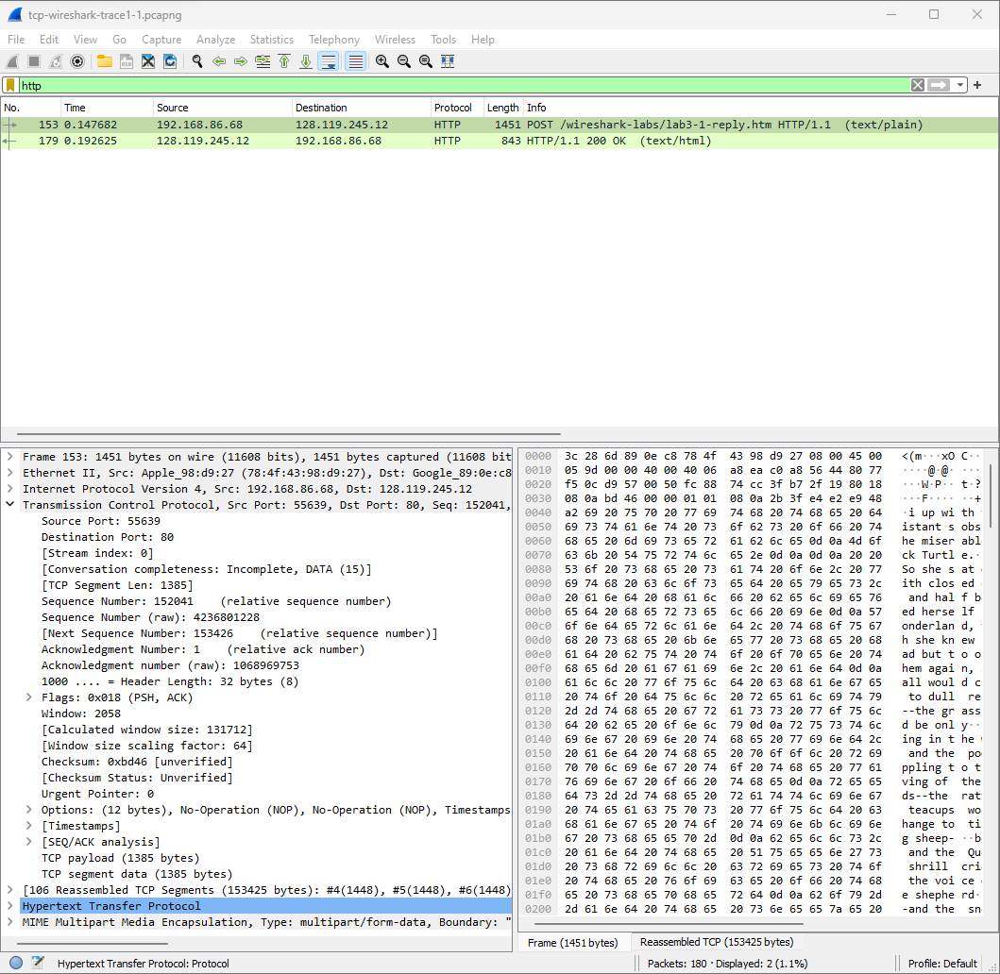
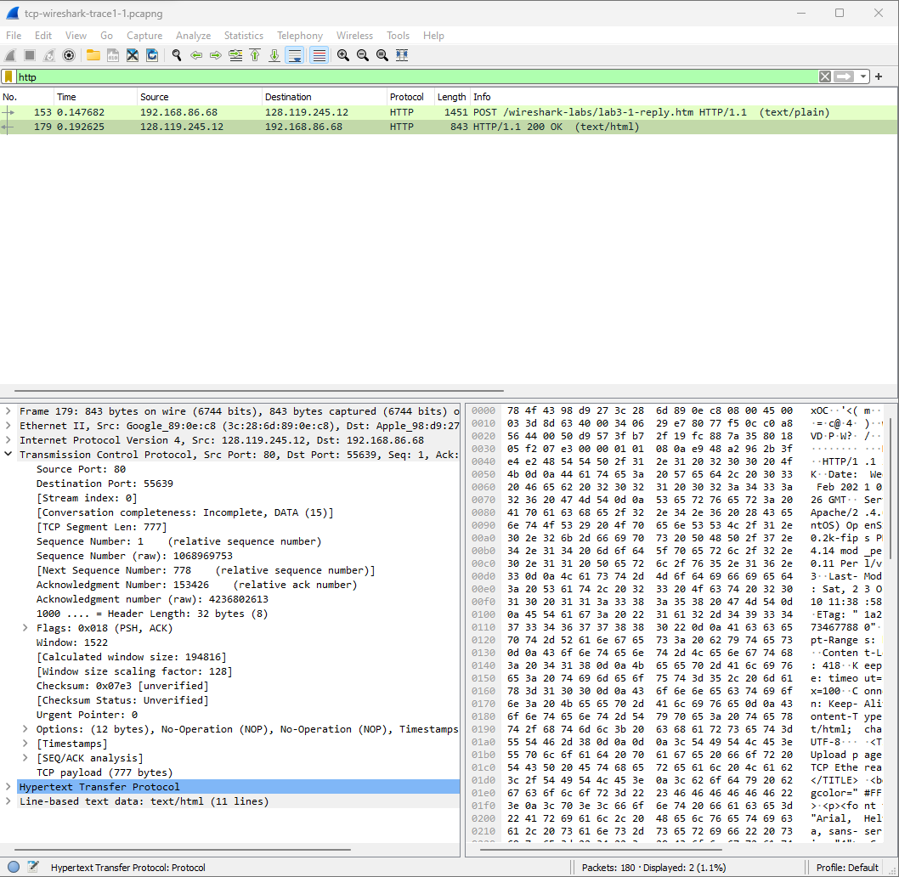
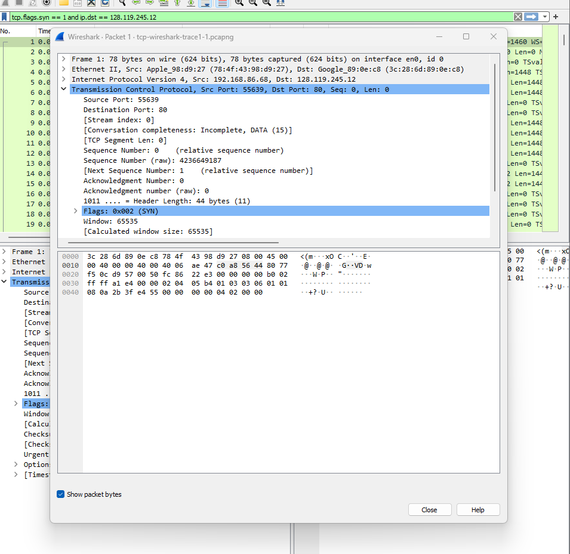
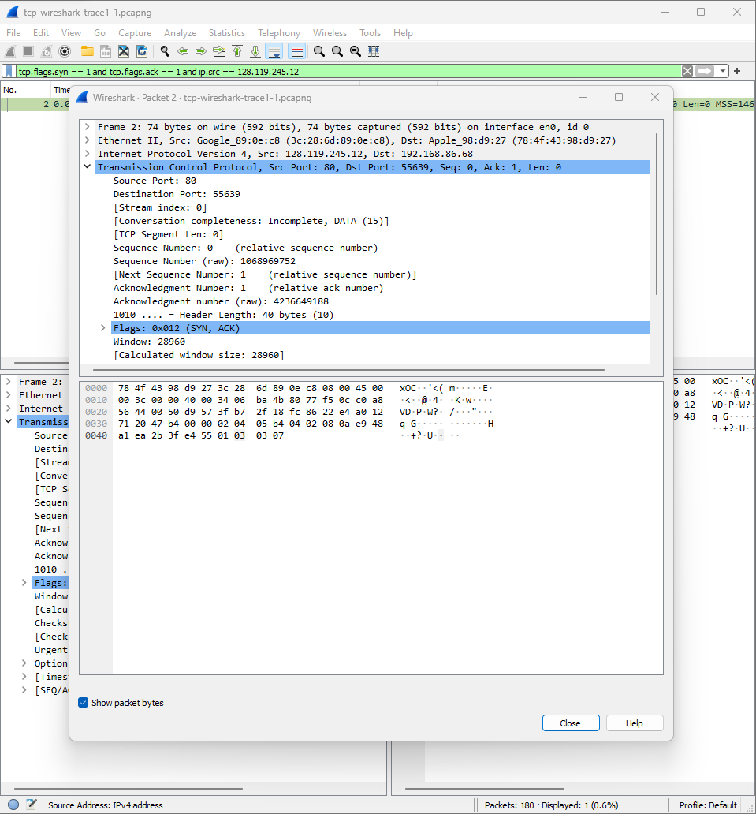
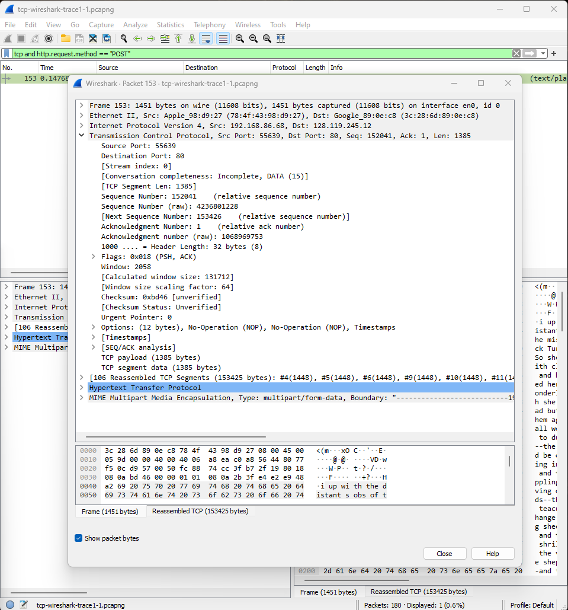
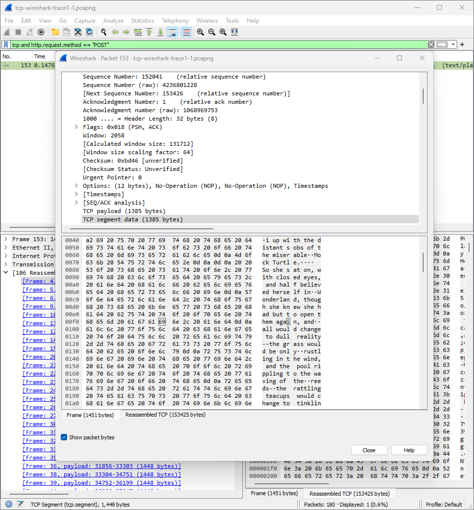
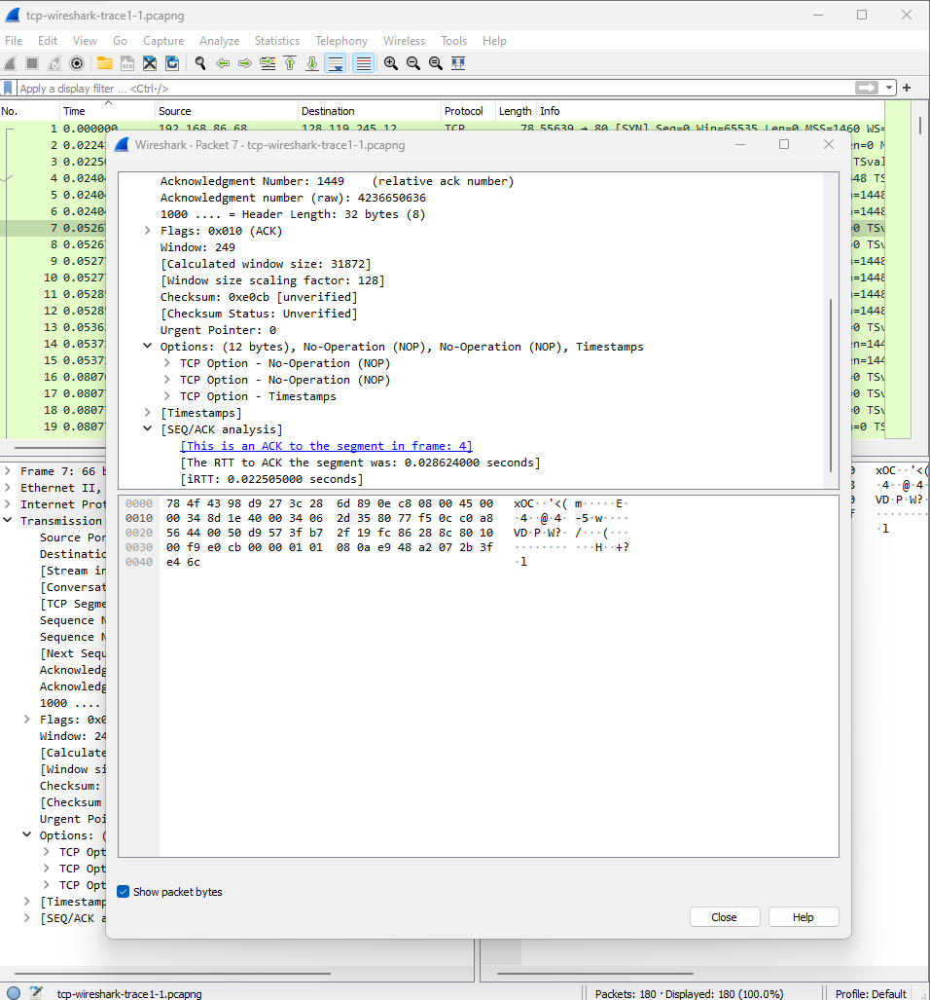
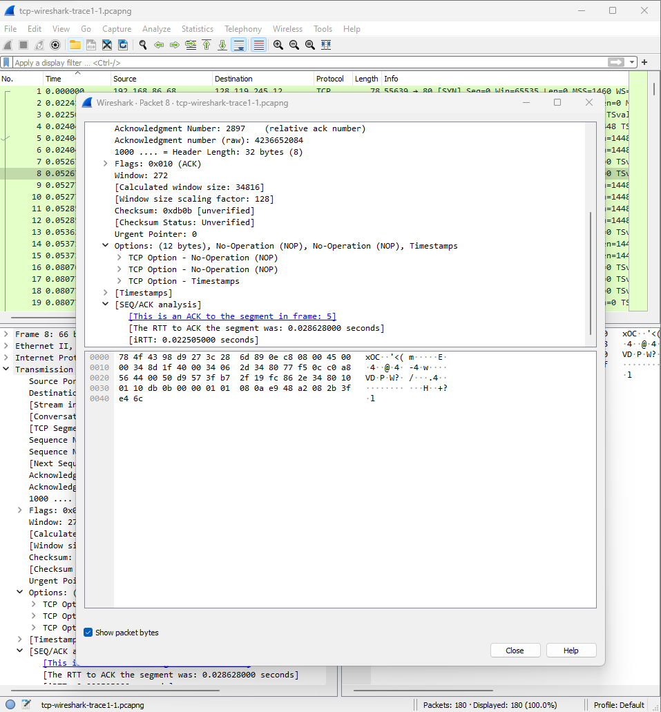
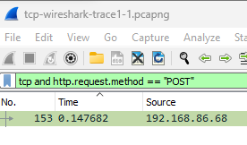

# Jarkom-Wireshark-TCP-UDOP

| Nama   | NRP  |
|-----------|-----------|
| Sandyatama Fransisna Nugraha | 5025211196 |


# Soal Materi 4 : TCP


### No 1
> What is the IP address and TCP port number used by the client computer (source) that is transferring the alice.txt file to gaia.cs.umass.edu? To answer this question, it’s probably easiest to select an HTTP message and explore the details of the TCP packet used to carry this HTTP message, using the “details of the selected packet header window” (refer to Figure 2 in the “Getting Started with Wireshark” Lab if you’re uncertain about the Wireshark windows).

Isi filtering dengan masukkan
````
http
````

Hasil yang didapatkan adalah seperti ini 

````
1. Ip Address             : 192.168.86.68
2. Destination Port       : 55639
````

### Klik IP yang paling atas (IP User)



### Soal No 2
> What is the IP address of gaia.cs.umass.edu? On what port number is it sending and receiving TCP segments for this connection?

Hasil yang didapatkan adalah seperti ini 

````
1. IP Address             : 128.119.245.12
2. Destination Port       : 80
````

### Klik IP yang paling bawah (IP gaia.cs.umass.edu)



### Soal No 3
> What is the sequence number of the TCP SYN segment that is used to initiate the TCP connection between the client computer and gaia.cs.umass.edu? (Note: this is the “raw” sequence number carried in the TCP segment itself; it is NOT the packet # in the “No.” column in the Wireshark window. Remember there is no such thing as a “packet number” in TCP or UDP; as you know, there are sequence numbers in TCP and that’s what we’re after here. Also note that this is not the relative sequence number with respect to the starting sequence number of this TCP session.). What is it in this TCP segment that identifies the segment as a SYN segment? Will the TCP receiver in this session be able to use Selective Acknowledgments (allowing TCP to function a bit more like a “selective repeat” receiver, see section 3.4.5 in the text)?


Hasil yang didapatkan adalah seperti ini 
````
1. Sequence Number: 0
   Sequence Number (raw) : 4236649187
2. Flag : 0x002
3. Iya, karena SACK diizinkan dalam segmen SYN 
````


### Soal No 4
> What is the sequence number of the SYNACK segment sent by gaia.cs.umass.edu to the client computer in reply to the SYN? What is it in the segment that identifies the segment as a SYNACK segment? What is the value of the Acknowledgement field in the SYNACK segment? How did gaia.cs.umass.edu determine that value?

Hasil yang didapatkan hasil
````
1. Sequence number : 0
   Sequence number (raw) : 1068969752
2. Flag            : 0x012  (SYN, ACK)
3. Acknowledgment number (raw) : 4236649187
4. Dari sequence number segmen SYN sebelumnya, yakni 4236649187, ditambah 1
````



### Soal No 5
> What is the sequence number of the TCP segment containing the header of the HTTP POST command? Note that in order to find the POST message header, you’ll need to dig into the packet content field at the bottom of the Wireshark window, looking for a segment with the ASCII text “POST” within its DATA field. How many bytes of data are contained in the payload (data) field of this TCP segment? Did all of the data in the transferred file alice.txt fit into this single segment?

Hasil yang didapatkan adalah seperti ini 
````
1. Sequence number : 152041
   Sequence number (raw): 4236649188
2. TCP Payload         : 1385 bytes
3. Tidak, karena paket dikirim menggunakan MIME multipart
````



### Soal No 6
> Consider the TCP segment containing the HTTP “POST” as the first segment in the data transfer part of the TCP connection.

> - At what time was the first segment (the one containing the HTTP POST) in the data-transfer part of the TCP connection sent?

> - At what time was the ACK for this first data-containing segment received?

> - What is the RTT for this first data-containing segment?

> - What is the RTT value the second data-carrying TCP segment and its ACK?


### Jawab

Isi filtering dengan masukkan
````
http.request.method == "POST"
````

Hasilnya  adalah seperti ini 

Hasil yang didapatkan adalah seperti ini 
````
1. 0.24047
2. 0.052671
3. 0.028624
4. 0.028628
````




### Soal No 7
> What is the length (header plus payload) of each of the first four data-carrying TCP segments?

Isi filtering dengan masukkan
````
http.request.method == "POST"
````

Hasil yang didapatkan adalah seperti ini 
````
4 * (Payload + Header) = 4 * (1448 + 32) = 4 * 1480 = 5920 byte
````


### Soal No 7
> What is the length (header plus payload) of each of the first four data-carrying TCP segments?

Isi filtering dengan masukkan
````
http.request.method == "POST"
````

Hasil yang didapatkan adalah seperti ini 
````
4 * (Payload + Header) = 4 * (1448 + 32) = 4 * 1480 = 5920 byte
````


### Soal No 8
> What is the length (header plus payload) of each of the first four data-carrying TCP segments?

Isi filtering dengan masukkan
````
http.request.method == "POST"
````

Hasil yang didapatkan adalah seperti ini 
````
1. 13712 yang didapat dari window size value
2. Receiver buffer spacer tidak pernah throttle sender karena window size value selalu lebih besar dari length
````


### Soal No 9
> What is the length (header plus payload) of each of the first four data-carrying TCP segments?

Isi filtering dengan masukkan
````
http.request.method == "POST"
````

Hasil yang didapatkan adalah seperti ini 
````
1. Ada
2. Retransmitted segments dapat dideteksi melalui sequence number. Ketika melakukan pengiriman ulang, terdapat paket yang sequence number paket selanjutnya tidak lebih besar dari sequence number paket sebelumnya.
````


### Soal No 10
> What is the length (header plus payload) of each of the first four data-carrying TCP segments?

Isi filtering dengan masukkan
````
http.request.method == "POST"
````

Hasil yang didapatkan adalah seperti ini 
````
1. 1448 byte
2. Jika data terdouble, segmen acking pada setiap segmen yang diterima, contohnya pada segmen kedua yang datanya terdouble dari 1448 menjadi 2896 byte
````


### Soal No 11
> What is the length (header plus payload) of each of the first four data-carrying TCP segments?


### Soal No 12
> Use the Time-Sequence-Graph(Stevens) plotting tool to view the sequence number versus time plot of segments being sent from the client to the gaia.cs.umass.edu server.


### Soal No 13
> What is the length (header plus payload) of each of the first four data-carrying TCP segments?


# Materi 5 : UDP
### Soal No 1
> Select the first UDP segment in your trace. What is the packet number4 of this segment in the trace file? 
> What type of application-layer payload or protocol message is being carried in this UDP segment? Look at the details of this packet in Wireshark. 
> How many fields there are in the UDP header? (You shouldn’t look in the textbook! Answer these questions directly from what you observe in the packet trace.) What are the names of these fields?

````
1. Packet number : 79
2. SSDP (Simple Service Discovery Protocol)
3. 4 field, source port, destination port, length, dan checksum
````


### Soal No 2
> By consulting the displayed information in Wireshark’s packet content field for this packet (or by consulting the textbook), what is the length (in bytes) of each of the UDP header fields?

````
Each field is 16 bits (2 bytes), since there are 4 fields, the length of each of the UDP header fields is 8 bytes
````


### Soal No 3
> The value in the Length field is the length of what? (You can consult the text for this answer). Verify your claim with your captured UDP packet. 

````
Header (8 byte) ditambah payload (175 byte) = 183
````


### Soal No 4
> What is the maximum number of bytes that can be included in a UDP payload? (Hint: the answer to this question can be determined by your answer to 2. above)

````
UDP berfield 16-bit yang memiliki panjang maksimum 65.535 byte, tetapi karena terdapat header (8 byte) maka panjang maksimumnya menjadi 65.527 byte (65.535 -8)
````

### Soal No 5
> What is the largest possible source port number? (Hint: see the hint in 4.)

````
65535, karena port direpresentasikan dengan 16 bit sehingga nomor yang memungkinkan antara 0 hingga 65535 (2^16 - 1)
````

### Soal No 6
> What is the protocol number for UDP? Give your answer in decimal notation. To answer this question, you’ll need to look into the Protocol field of the IP datagram containing this UDP segment (see Figure 4.13 in the text, and the discussion of IP header fields).

````
UDP adalah 17
````


### Soal No 7
> Examine the pair of UDP packets in which your host sends the first UDP packet and the second UDP packet is a reply to this first UDP packet. (Hint: for a second packet to be sent in response to a first packet, the sender of the first packet should be the destination of the second packet).

> What is the packet number5 of the first of these two UDP segments in the trace file?

> What is the packet number6 of the second of these two UDP segments in the trace file?

> Describe the relationship between the port numbers in the two packets.

````
Paket 1 = 747,748
Paket 2 = 750
Port source paket 1 adalah port destination paket 2 dan sebaliknya.
````
